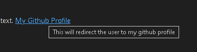

# Learning MarkDown markup language

## Paragraph

A Text without any symbols or a plain text will be considered as a paragraph.

## Italic

_A Text with 1 underscore or 1 star on left and right will be considered as italics_

## Bold

**A Text with 2 underscores or 2 stars on left and right will be considered as Bold**

## StrikeThrough

~~A Text with 2 tilde symbol on left and right will be considered as StrikeThrough~~

## Headers

# Header 1

Header 1 will also acts as a H1 tag in HTML. And also adding 3 equalto symbols below the Header will create the header 1

## header 2

Header 2 will also acts as a H2 tag in HTML. And also adding 3 minus symbols below the Header will create the header 1

### header 3

Header 3 will also acts as a H3 tag in HTML.

#### header 4

Header 4 will also acts as a H4 tag in HTML.

##### header 5

Header 5 will also acts as a H5 tag in HTML.

###### header 6

Header 6 will also acts as a H6 tag in HTML.

There are only headers upto 6 hash's

## Links

There are diffrent methods to use links in MD.

### Example 1:

This will directly put the link in the screen.
<https://github.com/tamil-hash>

### Example 2:

This will add the URL to the text given in the square brackets.
[My Github Profile](https://github.com/tamil-hash)

### Example 3:

This is same as the [example 2](#example-2) but we can also add the 2nd input string will as a url's alt text.
[My Github Profile](https://github.com/tamil-hash "This will redirect the user to my github profile")

**Preview**



### Example 4:

Here we can assign a url in a text and use it in the syntax to use the url
[My Github Profile][1]

[1]: https://github.com/tamil-hash

## Images

### Example 1:

This is the simplest way to adding an image to the MD. And it will preview in the image in its own size


### Example 2:

This is Same as the [example 1](#example-1-1) but the same input with text will act as a alt text and the first text in square brackets are just like a dummy text.


### Example 3:

This is Same as the [example 1](#example-1-1) but the same input with text will act as a alt text and the first text in square brackets are just like a dummy text.


## Lists

### Unordered

To create a unordered list items use any one of the -(minus), +(Plus), \*(star) symbols.

-  List item 1
-  List item 2
-  List item 3

### Ordered:

To create a ordered list items add the number before the text like below.

Example 1 (recommended):

1. List item 1
1. List item 2
1. List item 3

Example 2:

1. List item 1
2. List item 2
3. List item 3

### Nested

To Create a nested list items the inner list should be indented below the parent list item like below. Also the nested list depends on the indentation in the below example 4 space is used to indent and it may vary for diffrent browsers.

1. List item 1
   -  Nested item 1
      -  Inner nest item 1
         -  Deep nest item 1
         -  Deep nest item 2
         -  Deep nest item 3
      -  Inner nest item 2
      -  Inner nest item 3
   -  Nested item 2
   -  Nested item 3
1. List item 2
   1. Nested item 1
   1. Nested item 2
   1. Nested item 3
1. List item 3

## Line Breaks

Line breaks can be added by 2 methods. one is adding empty space between 2 lines and adding br tag to add line break.

### Example 1:

Line 1 is done.

Line 2 is done.

### Example 2:

Line 1 is done.<br>Line 2 is done.

## Horizontal Rules

To add Horizontal rule between 2 lines add extra space between 2 lines and 3 equals ( === ) or 3 minus( - ). Note if extra space is not added it will the above text into h1 if equal to is added and h2 if minus is added

Text line 1 is added.

===

Text line 2 is added.

## Block Quotes

To add block quotes add the greater than ( > ) symbol before text

> dudud ududud uduud -tamil

> dandanakka damukku nakka
>
> -**tamil**

## Code Blocks

Wrap the code with 3 backticks ( `) and add the language name to detect the code and highlight.

Here is my code:

```js
var x = 10;
var y = 20;

console.log(x + y);
```

To highlight the code in paragragh text use single backtick ( ` ) to highlight the code.

This is the example for text code highight `var x = 10;`

To show the diffrence between 2 code to remove a particular code and add new code use diff and 3 backticks ( `) and diff as language name

```diff
- var x = 10;
+ var x = 30;
var y = 20;

console.log(x + y);
```

## Table

To create a table add bar between the headers and data and to align data after the header add the colon on the bar sides to align on that side if it is added on both sides then it will be centre aligned.

| Name  |   Age | Married |
| :---- | ----: | :-----: |
| left  | right | center  |
| tamil |    25 |   no    |

## Todo list

To create todo list for tracking progress in gihub add a minus(-) space and add square brackets with space inbetween and the list item name.
The empty space in between the square brackets denotes that the list item is completed.
The 'x' in between the square brackets denotes that the list item is completed.

-  [x] Completed Todo list 1
-  [ ] Todo list 2
-  [ ] Todo list 3

## HTML

We can also add HTML elements tags directly in the MD and also style them inside the style tag.


<style>
  img {
    width: 100px;
    height: 100px;
  }
</style>
